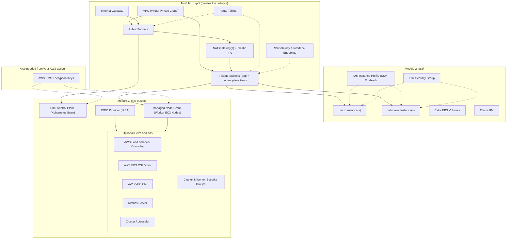
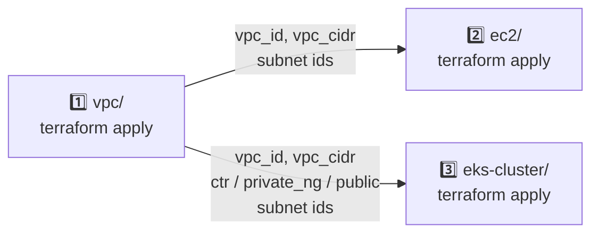

# AWS Infrastructure as Code (IaC) — VPC Network, EC2 Virtual Servers & Amazon EKS Cluster

Welcome to the **AWS Infrastructure as Code (IaC)** repository. This repository provides modular, production-ready **Terraform** configurations to deploy and manage core cloud infrastructure on **Amazon Web Services (AWS)**.

Whether you need the **network itself (VPC, subnets, NAT, VPC endpoints)**, standalone **virtual machines (Linux & Windows EC2)** or a full **enterprise-grade Kubernetes platform (Amazon EKS)**, this repository contains battle-tested code, security defaults (IMDSv2, KMS encryption, IAM Roles for Service Accounts), and simple plain-English instructions.

---

## 🏗️ Repository Architecture

This codebase is split into three independent, modular infrastructure directories. The `vpc/` directory **creates** the network; `ec2/` and `eks-cluster/` **consume** an existing one, so they work equally well against a VPC your company already runs.



---

## 📋 Quick Comparison: Which Module Do You Need?

| Feature / Requirement | [`vpc/`](file:///c:/Users/csbis/Documents/MyDocs/Codes/IaC_AWS/vpc/README.md) | [`ec2/`](file:///c:/Users/csbis/Documents/MyDocs/Codes/IaC_AWS/ec2/README.md) | [`eks-cluster/`](file:///c:/Users/csbis/Documents/MyDocs/Codes/IaC_AWS/eks-cluster/README.md) |
| --- | --- | --- | --- |
| **Primary Purpose** | The Network (VPC, subnets, routing, egress) | Virtual Servers / Virtual Machines (VMs) | Container Orchestration (Kubernetes Cluster) |
| **Creates or Consumes Network** | **Creates** it | Consumes an existing VPC + subnets | Consumes an existing VPC + subnets |
| **Best For** | A new account or environment that has no suitable VPC yet | Standalone apps, legacy software, SQL/Active Directory servers, web servers | Docker containers, microservices, auto-scaling web apps |
| **Management Overhead** | Very low once built — but the address plan is permanent | Moderate (OS patching, individual VM maintenance) | Low for cluster brain (AWS managed), containerized deployments |
| **Deployment Time** | ~2–4 minutes | ~2–3 minutes | ~15–20 minutes |
| **Idle Cost** | Free, except NAT gateways (~$33/month each) and interface endpoints | Per instance-hour + EBS storage | Control plane ~$73/month + worker nodes |

> 🧭 **Build order:** `vpc/` → `ec2/` and/or `eks-cluster/`. **Destroy order is the reverse.** If you already have a VPC and subnets you want to use, skip `vpc/` entirely.

---

## 🛠️ Prerequisites & Local Setup

Before running any of these Terraform configurations, ensure you have installed the required command-line tools and verified your AWS credentials.

### 1. Required CLI Tools

| Tool | Minimum Version | Purpose | Installation (Windows PowerShell) | Installation (macOS Homebrew) |
| --- | --- | --- | --- | --- |
| **Terraform** | `>= 1.6.0` | Infrastructure automation engine | `winget install Hashicorp.Terraform` | `brew install terraform` |
| **AWS CLI** | `v2.x` | Authenticates with your AWS account | `winget install Amazon.AWSCLI` | `brew install awscli` |
| **kubectl** | `>= 1.28` | *(For EKS)* Interact with Kubernetes | `winget install Kubernetes.kubectl` | `brew install kubectl` |
| **Helm** | `v3.x` | *(For EKS)* Deploy Kubernetes add-ons | `winget install Helm.Helm` | `brew install helm` |

### 2. Configure AWS Credentials

Run `aws configure` in your terminal to set your access keys and target AWS region:

```bash
aws configure
```
You will be prompted for:
- **AWS Access Key ID**: `AKIA...`
- **AWS Secret Access Key**: `wJalrXUtnFEMI/K7MDENG/bPxRfiCYEXAMPLEKEY`
- **Default region name**: `us-east-1` (or your target AWS region, e.g., `eu-central-1`, `ap-south-1`)
- **Default output format**: `json`

> [!TIP]
> Test your login by running `aws sts get-caller-identity`. If it returns your AWS Account ID and ARN, you are ready to proceed.

### 3. AWS Network Setup
The `ec2/` and `eks-cluster/` modules deploy resources into an **existing AWS Virtual Private Cloud (VPC)**. You need the following values for them:
- **VPC ID**: e.g., `vpc-0a1b2c3d4e5f67890`
- **VPC CIDR Block**: e.g., `10.0.0.0/16` or `172.35.0.0/19`
- **Subnet IDs**: At least 2 private subnets in different Availability Zones (AZs).

> 🆕 **Do not have a VPC yet?** Build one with [`vpc/`](file:///c:/Users/csbis/Documents/MyDocs/Codes/IaC_AWS/vpc/README.md) first — it prints those exact values as Terraform outputs when it finishes.

---

## 🌐 Module 1: VPC Network (`vpc/`)

The [`vpc`](file:///c:/Users/csbis/Documents/MyDocs/Codes/IaC_AWS/vpc) module builds the network everything else runs in: a VPC, a tiered set of subnets across availability zones, internet and NAT egress, route tables, and optional VPC endpoints.

### Key Capabilities
- **Data-Driven Subnet Layout**: Tiers are map entries (`pvt`, `ctr`, `pub`), each mapping availability zone → CIDR. Adding a zone or a whole tier is a few lines and never renumbers what already exists.
- **Cost-Aware Egress**: `nat_gateway_mode` picks `none`, `single` (cheapest) or `one_per_az` (no single point of failure) — the one setting that dominates the bill of an idle network.
- **Per-AZ Private Route Tables**: One route table per zone, so switching from a shared NAT gateway to one per zone needs no subnet to move.
- **VPC Endpoints Done Right**: A free S3 gateway endpoint keeps S3 traffic off the NAT gateway; interface endpoints (`ssm`, `ssmmessages`, `ec2messages`, `secretsmanager`, …) get one ENI per zone plus a security group that actually allows HTTPS to them.
- **Kubernetes-Ready Tagging**: `kubernetes.io/role/elb` and `internal-elb` tags for AWS Load Balancer Controller subnet auto-discovery.
- **Plan-Time Checks**: Impossible combinations (NAT without a public subnet, endpoints with nowhere to go, private DNS without VPC DNS) fail on `terraform plan` with a message naming the setting to change.

### Quick Setup & Deployment Steps

1. Navigate to the `vpc` directory:
   ```bash
   cd vpc
   ```

2. Create your settings file by copying the example configuration:
   ```bash
   cp tf-example.tfvars my-network.tfvars
   ```

3. Edit `my-network.tfvars`:
   ```hcl
   aws_region  = "eu-central-1"
   name_prefix = "my-company"
   vpc_cidr    = "172.32.0.0/16"

   subnet_groups = {
     "pvt" = {                          # Applications and EKS worker nodes
       tier            = "private"
       kubernetes_role = "internal-elb"
       cidrs = {
         "eu-central-1a" = "172.32.0.0/20"
         "eu-central-1b" = "172.32.16.0/20"
       }
     }
     "pub" = {                          # Load balancers and the NAT gateway
       tier            = "public"
       kubernetes_role = "elb"
       cidrs = {
         "eu-central-1a" = "172.32.96.0/20"
         "eu-central-1b" = "172.32.112.0/20"
       }
     }
   }

   nat_gateway_mode  = "single"          # "none" | "single" | "one_per_az"
   gateway_endpoints = ["s3"]            # Free, and saves NAT data charges
   ```

4. Build the network:
   ```bash
   terraform init
   terraform plan  -var-file=my-network.tfvars
   terraform apply -var-file=my-network.tfvars
   ```

### Handing the Network to the Other Modules

```bash
terraform output vpc_id              # -> vpc_id for ec2/ and eks-cluster/
terraform output ec2_subnet_ids      # -> the subnet_ids map ec2/ expects
terraform output eks_cluster_inputs  # -> vpc_id, vpc_cidr and the 3 subnet lists eks-cluster/ expects
```

For the full walkthrough, address planning advice, cost breakdown and recipes, see [`vpc/README.md`](file:///c:/Users/csbis/Documents/MyDocs/Codes/IaC_AWS/vpc/README.md).

---

## 🖥️ Module 2: EC2 Virtual Servers (`ec2/`)

The [`ec2`](file:///c:/Users/csbis/Documents/MyDocs/Codes/IaC_AWS/ec2) module provisions customizable virtual servers in AWS with production security controls enabled out of the box.

### Key Capabilities
- **Multi-Instance Map**: Define 1 or multiple servers in a single configuration file (`tfvars`).
- **Mixed OS Support**: Deploy Linux and Windows instances side-by-side.
- **Auto-AMI Resolution**: Uses AWS SSM Parameter Store to automatically fetch the latest official AMI for Amazon Linux 2023 or Windows Server 2022.
- **SSM Session Manager**: Pre-configured IAM instance profiles allow terminal access via AWS SSM without exposing SSH/RDP ports to the public internet.
- **Custom Storage**: Attach extra EBS volumes (gp2/gp3/io1/io2) with KMS encryption.
- **Static IPs**: Optionally allocate and attach Elastic IPs (EIP).

### Quick Setup & Deployment Steps

1. Navigate to the `ec2` directory:
   ```bash
   cd ec2
   ```

2. Create your settings file by copying the example configuration:
   ```bash
   cp tf_config_example.tfvars terraform.tfvars
   ```

3. Edit `terraform.tfvars` with your text editor of choice (e.g. VS Code, Notepad, Vim):
   ```hcl
   name_prefix = "my-company"
   vpc_id      = "vpc-0a1b2c3d4e5f67890"
   vpc_cidr    = "10.0.0.0/16"

   subnet_ids = {
     app_a = "subnet-11111111111111111"
     app_b = "subnet-22222222222222222"
   }

   # Instance definition map
   instances = {
     web-server = {
       os            = "linux"
       instance_type = "t3.micro"
       subnet_key    = "app_a"
       enable        = true
     }
     db-server = {
       os            = "windows"
       instance_type = "t3.medium"
       subnet_key    = "app_b"
       enable        = true
     }
   }
   ```

4. Initialize Terraform and apply configuration:
   ```bash
   terraform init
   terraform plan
   terraform apply
   ```

### Connecting to Your Virtual Servers

- **Via AWS Systems Manager (Recommended - No open SSH ports needed)**:
  ```bash
  aws ssm start-session --target i-0123456789abcdef0
  ```
- **Via SSH (Linux)**:
  ```bash
  ssh -i /path/to/my-key.pem ec2-user@<public-or-private-ip>
  ```
- **Via RDP (Windows)**:
  Retrieve the administrator password generated by Terraform:
  ```bash
  terraform output windows_passwords
  ```

For full details, variable references, and configuration recipes, see the [`ec2/README.md`](file:///c:/Users/csbis/Documents/MyDocs/Codes/IaC_AWS/ec2/README.md).

---

## ☸️ Module 3: Amazon EKS Cluster (`eks-cluster/`)

The [`eks-cluster`](file:///c:/Users/csbis/Documents/MyDocs/Codes/IaC_AWS/eks-cluster) module builds a managed **Amazon EKS Kubernetes Cluster** (Control Plane + Managed Node Groups) equipped with 5 optional Helm add-ons.

### Key Capabilities
- **Kubernetes Version Management**: Defaults to Kubernetes `1.30` with seamless upgrade paths.
- **Envelope Encryption**: KMS key integration for Kubernetes Secrets encryption.
- **IMDSv2 & Security Hardened**: Worker nodes enforce IMDSv2 (`http_tokens = required`, hop limit 2 for pods) and encrypted root EBS disks.
- **Modern EKS Access Entries**: Native IAM cluster admin integration without complex `aws-auth` ConfigMap editing.
- **IRSA (IAM Roles for Service Accounts)**: OpenID Connect (OIDC) provider configured for pod-level IAM authentication.
- **5 Gated Helm Add-ons**:
  1. `aws-load-balancer-controller`: Automatically provisions AWS ALBs/NLBs for Kubernetes Ingresses and Services.
  2. `aws-ebs-csi-driver`: Enables persistent storage volumes (`ReadWriteOnce`) backed by AWS EBS.
  3. `aws-vpc-cni`: Native AWS VPC networking for pods.
  4. `aws-metrics-server`: Enables `kubectl top nodes/pods` and Horizontal Pod Autoscaling (HPA).
  5. `aws-cluster-autoscaler`: Automatically adjusts Managed Node Group capacity based on unschedulable pod demand.

### Quick Setup & Deployment Steps

1. Navigate to the `eks-cluster` directory:
   ```bash
   cd eks-cluster
   ```

2. Create your settings file by copying the example configuration:
   ```bash
   cp tf_config_example.tfvars terraform.tfvars
   ```

3. Edit `terraform.tfvars`:
   ```hcl
   cluster_name = "dev-platform"
   aws_region   = "us-east-1"
   vpc_id       = "vpc-0a1b2c3d4e5f67890"
   vpc_cidr     = "172.35.0.0/19"

   # Control Plane subnets (minimum 2 in different AZs)
   ctr_subnet_ids = [
     "subnet-11111111111111111",
     "subnet-22222222222222222"
   ]

   # Worker Node Group subnets (private subnets with internet egress via NAT)
   private_ng_subnet_ids = [
     "subnet-11111111111111111",
     "subnet-22222222222222222"
   ]

   # Encryption keys
   kms_key_arn_eks = "arn:aws:kms:us-east-1:123456789012:key/your-eks-kms-key-id"
   kms_key_id_ebs  = "arn:aws:kms:us-east-1:123456789012:key/your-ebs-kms-key-id"

   # Node Group Capacity
   node_group_desired_capacity = 2
   node_group_min_capacity     = 1
   node_group_max_capacity     = 5
   instance_type               = ["t3.medium"]

   # Enable Optional Helm Add-ons
   enable_lbc                = true
   enable_ebs                = true
   enable_vpc_cni            = true
   enable_metrics_server     = true
   enable_cluster_autoscaler = true
   ```

4. Deploy the EKS Cluster and Add-ons:
   ```bash
   terraform init
   terraform plan
   terraform apply
   ```
   > ⏱️ *Note: EKS cluster creation typically takes 15–20 minutes.*

### Connecting to Your Kubernetes Cluster

Once `terraform apply` finishes, update your local `kubeconfig` using the command generated in Terraform output:

```bash
aws eks update-kubeconfig --name dev-platform-eks --region us-east-1
```

Verify your cluster connection and worker node health:
```bash
kubectl get nodes -o wide
kubectl get pods -A
```

For full details, add-on configurations, and advanced networking setup, see [`eks-cluster/README.md`](file:///c:/Users/csbis/Documents/MyDocs/Codes/IaC_AWS/eks-cluster/README.md).

---

## 🔗 End-to-End: Building the Whole Stack from an Empty Account

The three directories are separate Terraform configurations with separate state files — they are connected by **values you copy from one into the next**, not by Terraform references. That is deliberate: you can rebuild or destroy the servers without ever putting the network at risk.



### Step 1 — Build the network

```bash
cd vpc
cp tf-example.tfvars my-network.tfvars     # then edit region, name_prefix, vpc_cidr, subnet_groups
terraform init
terraform apply -var-file=my-network.tfvars
```

### Step 2 — Read the values the other two need

```bash
terraform output vpc_id
terraform output vpc_cidr
terraform output ec2_subnet_ids       # map, shaped for ec2/
terraform output eks_cluster_inputs   # object, shaped for eks-cluster/
```

`eks_cluster_inputs` comes out ready to paste:

```hcl
{
  "vpc_id"                = "vpc-0a1b2c3d4e5f67890"
  "vpc_cidr"              = "172.32.0.0/16"
  "ctr_subnet_ids"        = ["subnet-aaa…", "subnet-bbb…", "subnet-ccc…"]
  "private_ng_subnet_ids" = ["subnet-ddd…", "subnet-eee…", "subnet-fff…"]
  "public_subnet_ids"     = ["subnet-ggg…", "subnet-hhh…", "subnet-iii…"]
}
```

### Step 3 — Build the servers and/or the cluster

```bash
cd ../ec2
cp tf-example.tfvars my-servers.tfvars     # paste vpc_id, vpc_cidr, subnet_ids from Step 2
terraform init
terraform apply -var-file=my-servers.tfvars

cd ../eks-cluster
cp tf-example.tfvars my-cluster.tfvars     # paste the five values from eks_cluster_inputs
terraform init
terraform apply -var-file=my-cluster.tfvars
```

> 🏷️ **A note on the Kubernetes subnet tags.** `vpc/` writes `kubernetes.io/role/elb` and `kubernetes.io/role/internal-elb` onto its subnets (via `kubernetes_role`), and `eks-cluster/` writes the same two tags onto whatever subnet IDs you hand it. Both write the same value, so the two configurations agree and neither reverts the other on `apply`. If you would rather have `eks-cluster/` own those tags alone, set `kubernetes_role = ""` on your subnet groups.

> 🔁 **Changing the network later.** Adding a subnet group or an availability zone in `vpc/` never disturbs the existing subnets, so you can grow the network under a running cluster. Changing `vpc_cidr`, renaming a group's key, or changing an existing subnet's CIDR **replaces** those subnets and will fail while `ec2/` or `eks-cluster/` resources still sit in them.

---

## 🔒 Remote State Management (S3 + DynamoDB)

By default, Terraform stores infrastructure state locally in `terraform.tfstate`. For production environments or team collaboration, configure remote state storage with **Amazon S3** and state locking via **AWS DynamoDB**.

Each module directory ships with a `backend.tf` that stores state **locally** by default, plus a `tf_config_example.tfvars` holding the S3 settings:

```hcl
bucket         = "my-company-tfstate-bucket"
key            = "Dev/eu-central-1/vpc/terraform.tfstate" # or ec2/… , eks-cluster/…
region         = "eu-central-1"
dynamodb_table = "terraform-locks"
encrypt        = true
```

To enable remote state:
1. Create the S3 bucket and DynamoDB table (partition key: `LockID` of type String).
2. Set `use_s3_backend = true` in your `*.tfvars` (documentation only — the backend itself is chosen at init time).
3. Create a `backend_override.tf` in that module directory containing `terraform { backend "s3" {} }`.
4. Run `terraform init -backend-config=tf_config_example.tfvars -migrate-state` to push your existing state to S3.

> 💡 Give each module its own `key`. The `vpc/` state in particular is worth protecting first: every other configuration consumes IDs that live in it.

---

## 🧹 Deleting Infrastructure (Stopping Charges)

To remove all created resources and prevent unwanted AWS charges. **Destroy in the reverse order you built** — the network goes last, because a VPC cannot be deleted while anything still lives in it:

### 1. Deleting EKS Cluster & Helm Add-ons
```bash
cd eks-cluster
terraform destroy
```

### 2. Deleting EC2 Virtual Servers
```bash
cd ec2
terraform destroy
```

### 3. Deleting the VPC Network
```bash
cd vpc
terraform destroy
```

> [!WARNING]
> Ensure any Kubernetes Services of type `LoadBalancer` or Persistent Volume Claims (PVCs) created manually inside Kubernetes are deleted via `kubectl` prior to running `terraform destroy`. Otherwise, AWS Security Groups and EBS volumes created out-of-band may block Terraform from destroying the VPC interfaces — a `DependencyViolation` on the internet gateway or a subnet is almost always a leftover load balancer ENI.

---

## 📂 File Directory Map

```
IaC_AWS/
├── README.md                          <-- (This Document) Master Repository README
├── vpc/                               <-- VPC Network Module Directory
│   ├── README.md                      <-- Comprehensive VPC Setup & Address Planning Guide
│   ├── main.tf                        <-- Root VPC caller invoking ./modules/vpc
│   ├── variables.tf                   <-- VPC input variable schemas and defaults
│   ├── outputs.tf                     <-- Network IDs + ready-made inputs for ec2/ and eks-cluster/
│   ├── providers.tf                   <-- AWS provider configuration (~> 5.83)
│   ├── backend.tf                     <-- Local state by default, S3 via backend_override.tf
│   ├── tf-example.tfvars              <-- Comprehensive example variables template
│   ├── tf_config_example.tfvars       <-- S3 backend settings for `init -backend-config`
│   └── modules/
│       └── vpc/                       <-- Internal VPC Module Logic
│           ├── main.tf                <-- Subnet / NAT / endpoint layout computed from variables
│           ├── vpc.tf                 <-- aws_vpc & configuration-wide plan-time checks
│           ├── subnets.tf             <-- aws_subnet per group x availability zone
│           ├── igw.tf                 <-- Internet gateway
│           ├── nat.tf                 <-- Elastic IPs & NAT gateways (none/single/one_per_az)
│           ├── routes.tf              <-- Route tables, default routes, associations
│           ├── endpoints.tf           <-- Gateway (S3/DynamoDB) & interface VPC endpoints
│           └── security-group.tf      <-- HTTPS security group for the interface endpoints
│
├── ec2/                               <-- EC2 Virtual Server Module Directory
│   ├── README.md                      <-- Comprehensive EC2 Setup & Configuration Guide
│   ├── main.tf                        <-- Root EC2 caller invoking ./modules/ec2
│   ├── variables.tf                   <-- EC2 input variable schemas and defaults
│   ├── outputs.tf                     <-- EC2 output specs (IPs, SSM commands, pass)
│   ├── providers.tf                   <-- AWS provider configuration (~> 5.0)
│   ├── backend.tf                     <-- S3 + DynamoDB remote state backend
│   ├── tf-example.tfvars              <-- Comprehensive example variables template
│   ├── tf_config_example.tfvars       <-- Starter example tfvars template
│   └── modules/
│       └── ec2/                       <-- Internal EC2 Module Logic
│           ├── main.tf                <-- Instance map expanding & AMI logic
│           ├── instances.tf           <-- aws_instance resource & IMDSv2 configuration
│           ├── iam.tf                 <-- IAM instance profile & SSM policies
│           ├── security-group.tf      <-- Ingress/egress security group rules
│           ├── storage.tf             <-- Auxiliary data EBS volumes & attachments
│           ├── eip.tf                 <-- Elastic IP allocations & associations
│           └── network.tf             <-- VPC & Subnet data source resolution
│
└── eks-cluster/                       <-- Amazon EKS Cluster Module Directory
    ├── README.md                      <-- Comprehensive EKS Setup & Add-ons Guide
    ├── main.tf                        <-- Root caller for ./modules/eks & Helm Add-ons
    ├── variables.tf                   <-- EKS input variable schemas and defaults
    ├── outputs.tf                     <-- EKS outputs (endpoint, CA, kubeconfig command)
    ├── providers.tf                   <-- AWS, Helm & Kubernetes provider setup
    ├── backend.tf                     <-- S3 + DynamoDB remote state backend
    ├── tf-example.tfvars              <-- Comprehensive example variables template
    ├── tf_config_example.tfvars       <-- Starter example tfvars template
    └── modules/
        ├── eks/                       <-- Internal EKS Core Module
        │   ├── cluster.tf             <-- aws_eks_cluster control plane resource
        │   ├── node-group.tf          <-- Managed Node Group & launch template
        │   ├── access.tf              <-- EKS Access Entries & cluster admin rights
        │   ├── oidc.tf                <-- OpenID Connect provider for IRSA
        │   ├── security-groups.tf     <-- Control plane & worker security groups
        │   ├── subnet-tags.tf         <-- ALB/NLB auto-discovery subnet tagging
        │   ├── iam-cluster.tf         <-- EKS control plane IAM role
        │   └── iam-node.tf            <-- Managed Node Group IAM role & policies
        └── addons/                    <-- Helm Add-on Modules
            ├── aws-load-balancer-controller/ <-- AWS ALB / NLB Ingress Controller
            ├── aws-ebs-csi-driver/           <-- Storage CSI Driver for EBS
            ├── aws-vpc-cni/                  <-- AWS VPC Container Network Interface
            ├── aws-metrics-server/           <-- Kubernetes Metrics Server
            └── aws-cluster-autoscaler/       <-- Worker Node Cluster Autoscaler
```

---

## ❓ Frequently Asked Questions (FAQ) & Troubleshooting

<details>
<summary><b>Q: I get "Parameter encrypted is invalid" when launching an EC2 instance.</b></summary>

Some third-party or older marketplace AMIs cannot be re-encrypted at launch time from an unencrypted snapshot. To fix this, set `root_volume_encrypted = false` in your `terraform.tfvars` or select a standard Amazon Linux 2023 / Ubuntu AMI.
</details>

<details>
<summary><b>Q: Why do my EKS worker nodes fail to join the cluster?</b></summary>

Worker nodes must be placed in **private subnets** with outbound internet egress (via an AWS NAT Gateway or VPC Endpoints for EKS/EC2/ECR). If nodes have no route to reach the EKS control plane API endpoint, they will fail to register.

If you built the network with `vpc/`, check that `nat_gateway_mode` is not `"none"` and that the subnets you passed as `private_ng_subnet_ids` are from a group with `tier = "private"` — a private group with no NAT gateway and no `interface_endpoints` has no way out at all.
</details>

<details>
<summary><b>Q: Do I have to use the <code>vpc/</code> module?</b></summary>

No. `ec2/` and `eks-cluster/` only ever *read* a VPC and its subnets, so an existing company VPC works exactly as well — you just supply the IDs yourself. Use `vpc/` when you are starting in an empty account or want the network under the same Terraform workflow as everything else.
</details>

<details>
<summary><b>Q: My VPC costs money while nothing is running. Why?</b></summary>

The VPC, subnets, route tables and internet gateway are free. A **NAT gateway** is not: it is billed per hour whether or not traffic passes through it, and interface VPC endpoints are billed per hour per availability zone. In `vpc/`, set `nat_gateway_mode = "none"` for an environment whose private subnets only need to reach AWS APIs (add the matching `interface_endpoints` instead), or `"single"` to run just one.
</details>

<details>
<summary><b>Q: How do I update Kubernetes or Helm add-ons later?</b></summary>

Simply edit the relevant variable in `terraform.tfvars` (e.g. `cluster_version = "1.31"` or `lb_chart_version = "1.8.0"`) and re-run `terraform plan` and `terraform apply`. Terraform handles in-place upgrades.
</details>

---

## 📄 License & Maintenance

This repository is maintained for automated AWS Infrastructure as Code deployment. All configurations follow standard AWS security recommendations (IMDSv2, KMS encryption, least privilege IAM).