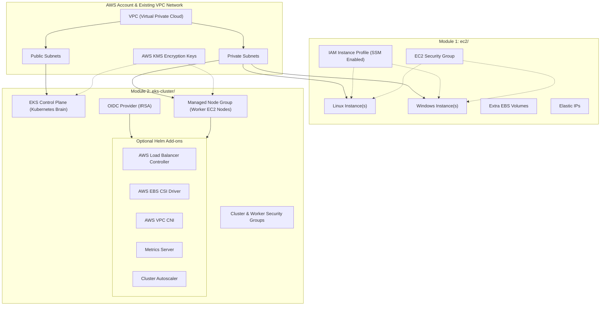

# AWS Infrastructure as Code (IaC) — EC2 Virtual Servers & Amazon EKS Cluster

Welcome to the **AWS Infrastructure as Code (IaC)** repository. This repository provides modular, production-ready **Terraform** configurations to deploy and manage core cloud compute infrastructure on **Amazon Web Services (AWS)**.

Whether you need standalone **virtual machines (Linux & Windows EC2)** or a full **enterprise-grade Kubernetes platform (Amazon EKS)**, this repository contains battle-tested code, security defaults (IMDSv2, KMS encryption, IAM Roles for Service Accounts), and simple plain-English instructions.

---

## 🏗️ Repository Architecture

This codebase is split into two independent, modular infrastructure directories:



---

## 📋 Quick Comparison: Which Module Do You Need?

| Feature / Requirement | [`ec2/`](file:///c:/Users/csbis/Documents/MyDocs/Codes/IaC_AWS/ec2/README.md) | [`eks-cluster/`](file:///c:/Users/csbis/Documents/MyDocs/Codes/IaC_AWS/eks-cluster/README.md) |
| --- | --- | --- |
| **Primary Purpose** | Virtual Servers / Virtual Machines (VMs) | Container Orchestration (Kubernetes Cluster) |
| **Operating Systems** | Linux (Amazon Linux, Ubuntu, RHEL) & Windows Server | Linux Worker Nodes (Optimized Amazon Linux / Bottlerocket) |
| **Best For** | Standalone apps, legacy software, SQL/Active Directory servers, web servers | Docker containers, microservices, auto-scaling web apps |
| **Management Overhead** | Moderate (OS patching, individual VM maintenance) | Low for cluster brain (AWS managed), containerized deployments |
| **Deployment Time** | ~2–3 minutes | ~15–20 minutes |
| **Remote Access** | AWS Systems Manager (SSM Session Manager), SSH, RDP | `kubectl` CLI, Helm, AWS EKS Access Entries |

---

## 🛠️ Prerequisites & Local Setup

Before running either Terraform configuration, ensure you have installed the required command-line tools and verified your AWS credentials.

### 1. Required CLI Tools

| Tool | Minimum Version | Purpose | Installation (Windows PowerShell) | Installation (macOS Homebrew) |
| --- | --- | --- | --- | --- |
| **Terraform** | `>= 1.6.0` | Infrastructure automation engine | `winget install Hashicorp.Terraform` | `brew install terraform` |
| **AWS CLI** | `v2.x` | Authenticates with your AWS account | `winget install Amazon.AWSCLI` | `brew install awscli` |
| **kubectl** | `>= 1.28` | *(For EKS)* Interact with Kubernetes | `winget install Kubernetes.kubectl` | `brew install kubectl` |
| **Helm** | `v3.x` | *(For EKS)* Deploy Kubernetes add-ons | `winget install Helm.Helm` | `brew install helm` |

### 2. Configure AWS Credentials

Run `aws configure` in your terminal to set your access keys and target AWS region:

```bash
aws configure
```
You will be prompted for:
- **AWS Access Key ID**: `AKIA...`
- **AWS Secret Access Key**: `wJalrXUtnFEMI/K7MDENG/bPxRfiCYEXAMPLEKEY`
- **Default region name**: `us-east-1` (or your target AWS region, e.g., `eu-central-1`, `ap-south-1`)
- **Default output format**: `json`

> [!TIP]
> Test your login by running `aws sts get-caller-identity`. If it returns your AWS Account ID and ARN, you are ready to proceed.

### 3. Existing AWS Network Setup
Both modules deploy resources into an **existing AWS Virtual Private Cloud (VPC)**. Ensure you have the following IDs from your AWS console:
- **VPC ID**: e.g., `vpc-0a1b2c3d4e5f67890`
- **VPC CIDR Block**: e.g., `10.0.0.0/16` or `172.35.0.0/19`
- **Subnet IDs**: At least 2 private subnets in different Availability Zones (AZs).

---

## 🖥️ Module 1: EC2 Virtual Servers (`ec2/`)

The [`ec2`](file:///c:/Users/csbis/Documents/MyDocs/Codes/IaC_AWS/ec2) module provisions customizable virtual servers in AWS with production security controls enabled out of the box.

### Key Capabilities
- **Multi-Instance Map**: Define 1 or multiple servers in a single configuration file (`tfvars`).
- **Mixed OS Support**: Deploy Linux and Windows instances side-by-side.
- **Auto-AMI Resolution**: Uses AWS SSM Parameter Store to automatically fetch the latest official AMI for Amazon Linux 2023 or Windows Server 2022.
- **SSM Session Manager**: Pre-configured IAM instance profiles allow terminal access via AWS SSM without exposing SSH/RDP ports to the public internet.
- **Custom Storage**: Attach extra EBS volumes (gp2/gp3/io1/io2) with KMS encryption.
- **Static IPs**: Optionally allocate and attach Elastic IPs (EIP).

### Quick Setup & Deployment Steps

1. Navigate to the `ec2` directory:
   ```bash
   cd ec2
   ```

2. Create your settings file by copying the example configuration:
   ```bash
   cp tf_config_example.tfvars terraform.tfvars
   ```

3. Edit `terraform.tfvars` with your text editor of choice (e.g. VS Code, Notepad, Vim):
   ```hcl
   name_prefix = "my-company"
   vpc_id      = "vpc-0a1b2c3d4e5f67890"
   vpc_cidr    = "10.0.0.0/16"

   subnet_ids = {
     app_a = "subnet-11111111111111111"
     app_b = "subnet-22222222222222222"
   }

   # Instance definition map
   instances = {
     web-server = {
       os            = "linux"
       instance_type = "t3.micro"
       subnet_key    = "app_a"
       enable        = true
     }
     db-server = {
       os            = "windows"
       instance_type = "t3.medium"
       subnet_key    = "app_b"
       enable        = true
     }
   }
   ```

4. Initialize Terraform and apply configuration:
   ```bash
   terraform init
   terraform plan
   terraform apply
   ```

### Connecting to Your Virtual Servers

- **Via AWS Systems Manager (Recommended - No open SSH ports needed)**:
  ```bash
  aws ssm start-session --target i-0123456789abcdef0
  ```
- **Via SSH (Linux)**:
  ```bash
  ssh -i /path/to/my-key.pem ec2-user@<public-or-private-ip>
  ```
- **Via RDP (Windows)**:
  Retrieve the administrator password generated by Terraform:
  ```bash
  terraform output windows_passwords
  ```

For full details, variable references, and configuration recipes, see the [`ec2/README.md`](file:///c:/Users/csbis/Documents/MyDocs/Codes/IaC_AWS/ec2/README.md).

---

## ☸️ Module 2: Amazon EKS Cluster (`eks-cluster/`)

The [`eks-cluster`](file:///c:/Users/csbis/Documents/MyDocs/Codes/IaC_AWS/eks-cluster) module builds a managed **Amazon EKS Kubernetes Cluster** (Control Plane + Managed Node Groups) equipped with 5 optional Helm add-ons.

### Key Capabilities
- **Kubernetes Version Management**: Defaults to Kubernetes `1.30` with seamless upgrade paths.
- **Envelope Encryption**: KMS key integration for Kubernetes Secrets encryption.
- **IMDSv2 & Security Hardened**: Worker nodes enforce IMDSv2 (`http_tokens = required`, hop limit 2 for pods) and encrypted root EBS disks.
- **Modern EKS Access Entries**: Native IAM cluster admin integration without complex `aws-auth` ConfigMap editing.
- **IRSA (IAM Roles for Service Accounts)**: OpenID Connect (OIDC) provider configured for pod-level IAM authentication.
- **5 Gated Helm Add-ons**:
  1. `aws-load-balancer-controller`: Automatically provisions AWS ALBs/NLBs for Kubernetes Ingresses and Services.
  2. `aws-ebs-csi-driver`: Enables persistent storage volumes (`ReadWriteOnce`) backed by AWS EBS.
  3. `aws-vpc-cni`: Native AWS VPC networking for pods.
  4. `aws-metrics-server`: Enables `kubectl top nodes/pods` and Horizontal Pod Autoscaling (HPA).
  5. `aws-cluster-autoscaler`: Automatically adjusts Managed Node Group capacity based on unschedulable pod demand.

### Quick Setup & Deployment Steps

1. Navigate to the `eks-cluster` directory:
   ```bash
   cd eks-cluster
   ```

2. Create your settings file by copying the example configuration:
   ```bash
   cp tf_config_example.tfvars terraform.tfvars
   ```

3. Edit `terraform.tfvars`:
   ```hcl
   cluster_name = "dev-platform"
   aws_region   = "us-east-1"
   vpc_id       = "vpc-0a1b2c3d4e5f67890"
   vpc_cidr     = "172.35.0.0/19"

   # Control Plane subnets (minimum 2 in different AZs)
   ctr_subnet_ids = [
     "subnet-11111111111111111",
     "subnet-22222222222222222"
   ]

   # Worker Node Group subnets (private subnets with internet egress via NAT)
   private_ng_subnet_ids = [
     "subnet-11111111111111111",
     "subnet-22222222222222222"
   ]

   # Encryption keys
   kms_key_arn_eks = "arn:aws:kms:us-east-1:123456789012:key/your-eks-kms-key-id"
   kms_key_id_ebs  = "arn:aws:kms:us-east-1:123456789012:key/your-ebs-kms-key-id"

   # Node Group Capacity
   node_group_desired_capacity = 2
   node_group_min_capacity     = 1
   node_group_max_capacity     = 5
   instance_type               = ["t3.medium"]

   # Enable Optional Helm Add-ons
   enable_lbc                = true
   enable_ebs                = true
   enable_vpc_cni            = true
   enable_metrics_server     = true
   enable_cluster_autoscaler = true
   ```

4. Deploy the EKS Cluster and Add-ons:
   ```bash
   terraform init
   terraform plan
   terraform apply
   ```
   > ⏱️ *Note: EKS cluster creation typically takes 15–20 minutes.*

### Connecting to Your Kubernetes Cluster

Once `terraform apply` finishes, update your local `kubeconfig` using the command generated in Terraform output:

```bash
aws eks update-kubeconfig --name dev-platform-eks --region us-east-1
```

Verify your cluster connection and worker node health:
```bash
kubectl get nodes -o wide
kubectl get pods -A
```

For full details, add-on configurations, and advanced networking setup, see [`eks-cluster/README.md`](file:///c:/Users/csbis/Documents/MyDocs/Codes/IaC_AWS/eks-cluster/README.md).

---

## 🔒 Remote State Management (S3 + DynamoDB)

By default, Terraform stores infrastructure state locally in `terraform.tfstate`. For production environments or team collaboration, configure remote state storage with **Amazon S3** and state locking via **AWS DynamoDB**.

Each module directory contains a pre-configured `backend.tf` file:

```hcl
terraform {
  backend "s3" {
    bucket         = "my-company-tfstate-bucket"
    key            = "infrastructure/ec2/terraform.tfstate" # or eks-cluster/terraform.tfstate
    region         = "us-east-1"
    dynamodb_table = "terraform-locks"
    encrypt        = true
  }
}
```

To enable remote state:
1. Create the S3 bucket and DynamoDB table (partition key: `LockID` of type String).
2. Uncomment the `backend "s3"` block in `backend.tf`.
3. Run `terraform init -migrate-state` to push your existing state to S3.

---

## 🧹 Deleting Infrastructure (Stopping Charges)

To remove all created resources and prevent unwanted AWS charges:

### Deleting EC2 Virtual Servers
```bash
cd ec2
terraform destroy
```

### Deleting EKS Cluster & Helm Add-ons
```bash
cd eks-cluster
terraform destroy
```

> [!WARNING]
> Ensure any Kubernetes Services of type `LoadBalancer` or Persistent Volume Claims (PVCs) created manually inside Kubernetes are deleted via `kubectl` prior to running `terraform destroy`. Otherwise, AWS Security Groups and EBS volumes created out-of-band may block Terraform from destroying the VPC interfaces.

---

## 📂 File Directory Map

```
IaC_AWS/
├── README.md                          <-- (This Document) Master Repository README
├── ec2/                               <-- EC2 Virtual Server Module Directory
│   ├── README.md                      <-- Comprehensive EC2 Setup & Configuration Guide
│   ├── main.tf                        <-- Root EC2 caller invoking ./modules/ec2
│   ├── variables.tf                   <-- EC2 input variable schemas and defaults
│   ├── outputs.tf                     <-- EC2 output specs (IPs, SSM commands, pass)
│   ├── providers.tf                   <-- AWS provider configuration (~> 5.0)
│   ├── backend.tf                     <-- S3 + DynamoDB remote state backend
│   ├── tf-example.tfvars              <-- Comprehensive example variables template
│   ├── tf_config_example.tfvars       <-- Starter example tfvars template
│   └── modules/
│       └── ec2/                       <-- Internal EC2 Module Logic
│           ├── main.tf                <-- Instance map expanding & AMI logic
│           ├── instances.tf           <-- aws_instance resource & IMDSv2 configuration
│           ├── iam.tf                 <-- IAM instance profile & SSM policies
│           ├── security-group.tf      <-- Ingress/egress security group rules
│           ├── storage.tf             <-- Auxiliary data EBS volumes & attachments
│           ├── eip.tf                 <-- Elastic IP allocations & associations
│           └── network.tf             <-- VPC & Subnet data source resolution
│
└── eks-cluster/                       <-- Amazon EKS Cluster Module Directory
    ├── README.md                      <-- Comprehensive EKS Setup & Add-ons Guide
    ├── main.tf                        <-- Root caller for ./modules/eks & Helm Add-ons
    ├── variables.tf                   <-- EKS input variable schemas and defaults
    ├── outputs.tf                     <-- EKS outputs (endpoint, CA, kubeconfig command)
    ├── providers.tf                   <-- AWS, Helm & Kubernetes provider setup
    ├── backend.tf                     <-- S3 + DynamoDB remote state backend
    ├── tf-example.tfvars              <-- Comprehensive example variables template
    ├── tf_config_example.tfvars       <-- Starter example tfvars template
    └── modules/
        ├── eks/                       <-- Internal EKS Core Module
        │   ├── cluster.tf             <-- aws_eks_cluster control plane resource
        │   ├── node-group.tf          <-- Managed Node Group & launch template
        │   ├── access.tf              <-- EKS Access Entries & cluster admin rights
        │   ├── oidc.tf                <-- OpenID Connect provider for IRSA
        │   ├── security-groups.tf     <-- Control plane & worker security groups
        │   ├── subnet-tags.tf         <-- ALB/NLB auto-discovery subnet tagging
        │   ├── iam-cluster.tf         <-- EKS control plane IAM role
        │   └── iam-node.tf            <-- Managed Node Group IAM role & policies
        └── addons/                    <-- Helm Add-on Modules
            ├── aws-load-balancer-controller/ <-- AWS ALB / NLB Ingress Controller
            ├── aws-ebs-csi-driver/           <-- Storage CSI Driver for EBS
            ├── aws-vpc-cni/                  <-- AWS VPC Container Network Interface
            ├── aws-metrics-server/           <-- Kubernetes Metrics Server
            └── aws-cluster-autoscaler/       <-- Worker Node Cluster Autoscaler
```

---

## ❓ Frequently Asked Questions (FAQ) & Troubleshooting

<details>
<summary><b>Q: I get "Parameter encrypted is invalid" when launching an EC2 instance.</b></summary>

Some third-party or older marketplace AMIs cannot be re-encrypted at launch time from an unencrypted snapshot. To fix this, set `root_volume_encrypted = false` in your `terraform.tfvars` or select a standard Amazon Linux 2023 / Ubuntu AMI.
</details>

<details>
<summary><b>Q: Why do my EKS worker nodes fail to join the cluster?</b></summary>

Worker nodes must be placed in **private subnets** with outbound internet egress (via an AWS NAT Gateway or VPC Endpoints for EKS/EC2/ECR). If nodes have no route to reach the EKS control plane API endpoint, they will fail to register.
</details>

<details>
<summary><b>Q: How do I update Kubernetes or Helm add-ons later?</b></summary>

Simply edit the relevant variable in `terraform.tfvars` (e.g. `cluster_version = "1.31"` or `lb_chart_version = "1.8.0"`) and re-run `terraform plan` and `terraform apply`. Terraform handles in-place upgrades.
</details>

---

## 📄 License & Maintenance

This repository is maintained for automated AWS Infrastructure as Code deployment. All configurations follow standard AWS security recommendations (IMDSv2, KMS encryption, least privilege IAM).
